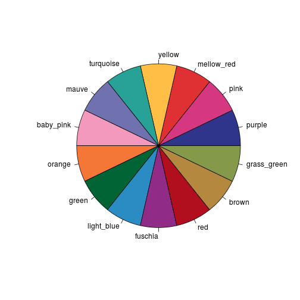
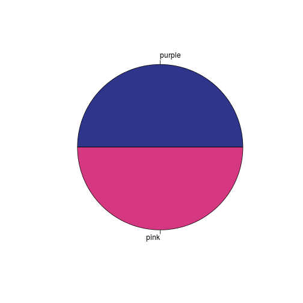
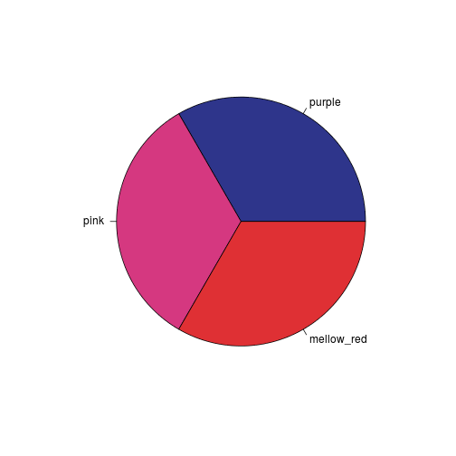
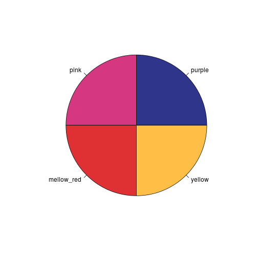
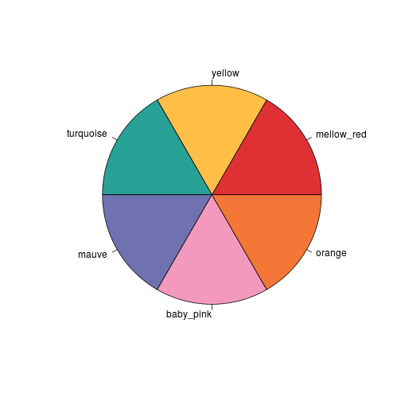
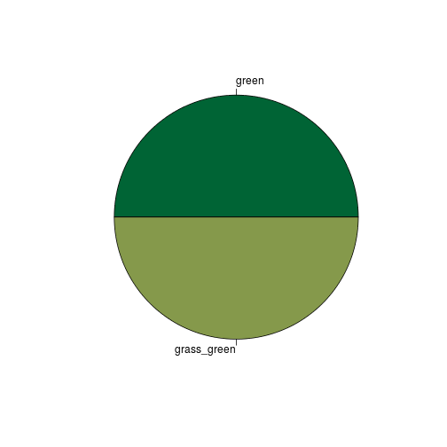

[](https://travis-ci.org/ivyleavedtoadflax/govstyle)
[](http://codecov.io/github/ivyleavedtoadflax/govstyle?branch=master)

# govstyle

A package for producing graphics following the [gov.uk](http://www.gov.uk) style.

## Functions

* `theme_gov()`: Theme to be applied to plots produced in [ggplot2]() to give a government statistics publication feel.
* `check_pal()`: Display the a gov.uk recommended colours in a pie chart.
* `gov_cols`: A vector of the [gov.uk]() recommended colours.

## Examples

### theme_gov


```r
library(ggplot2)
library(dplyr)
#devtools::install_github("ivyleavedtoadflax/govstyle")
library(govstyle)
```


```r
p <- mtcars %>%
  ggplot +
  aes(
    x = wt,
    y = mpg,
    col = factor(cyl)
    ) +
  geom_point()

p
```


```r
p +
  theme_gov()
```


### check_pal


```r
## Show gov.uk colours

check_pal()
```



```r
## Show a subset of gov.uk colours

## Choose n colours:

check_pal(2)
```



```r
check_pal(3)
```



```r
check_pal(4)
```



```r
## Pick a range of colours

check_pal(3:8)
```



```r
check_pal(c(1,10))
```


```r
## Pick colours manually

check_pal(
  x = gov_cols[c("green", "grass_green")]
  )
```


